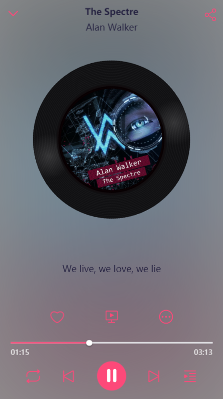
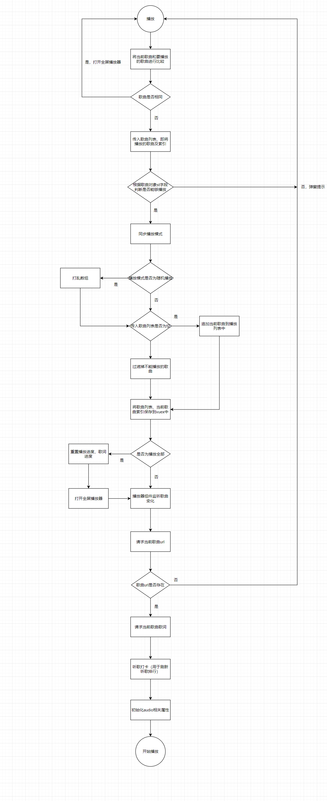
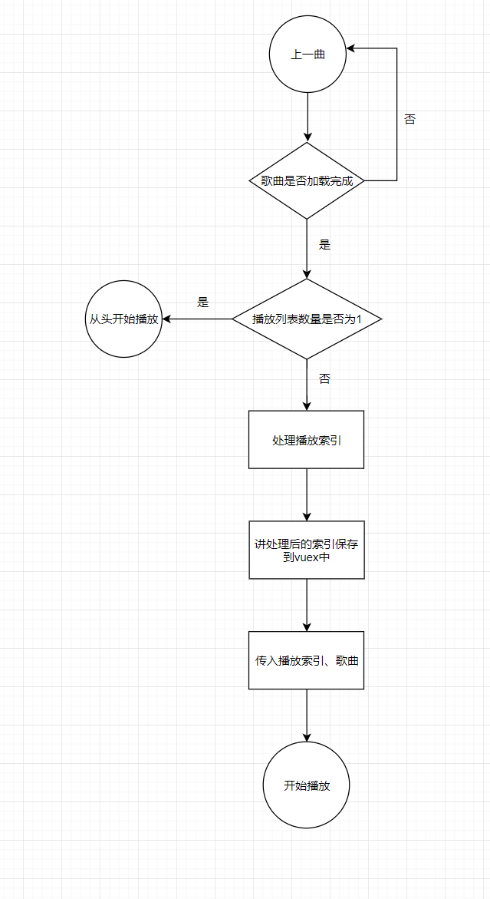
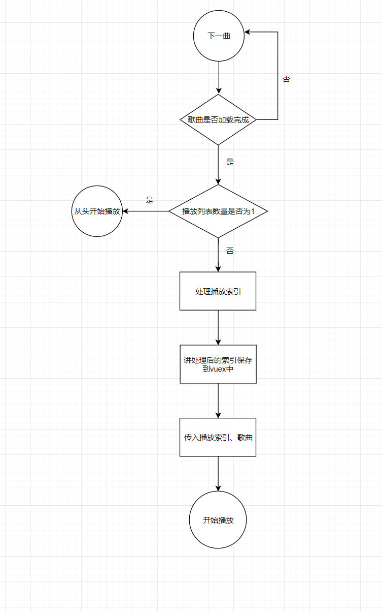

# 效果图



## 功能介绍

1. 歌曲播放
2. 上一曲
3. 下一曲
4. 播放模式切换（顺序播放、随机播放、单曲循环）
5. 歌词
6. 歌曲列表
7. 歌曲评论
8. 歌曲收藏
9. 歌曲mv
10. 歌曲列表
11. 歌曲分享
12. 查看歌手

## 业务流程图



## 播放暂停

- 在vuex中保存播放状态

- 根据播放状态控制audio中的`play()`和`pause()`

- 根据播放状态改变播放图标

- 根据播放状态控制音量

  ```javascript
  playing (newPlaying) {
    let audio = this.audio
    clearInterval(this.t1)
    clearInterval(this.t2)
    console.log(newPlaying)
    if (newPlaying) {
      // 如果有视频播放就暂停
      // if (this.oldVideo.$data && this.oldVideo.$data.isPlay) {
      //   this.oldVideo.pauseCurrentVideo()
      // }
      this.$nextTick(() => {
        audio.play()
        let v = 0
        audio.volume = 0
        // 加音量
        this.t1 = setInterval(() => {
          v += 0.1
          if (v <= 1) {
            audio.volume = v
          }
          if (v >= 1) {
            clearInterval(this.t1)
          }
        }, 50)
      })
    } else {
      this.$nextTick(() => {
        let v = audio.volume
        clearInterval(this.t2)
        // 减音量
        this.t2 = setInterval(() => {
          v -= 0.1
          if (v >= 0) {
            audio.volume = v
          }
          if (v <= 0) {
            audio.pause()
            audio.volume = 0
            clearInterval(this.t2)
          }
        }, 50)
      })
    }
  }
  ```

## 上一曲



### 核心代码

限制索引

```javascript
// 限制索引
limitCutIndex(index, length) {
  index = --index
  if (index < 0) { // 如果当前索引超过播放列表长度就赋值为0
    index = length
  }
  return index
}
```

```javascript
// 上一曲
prev({
  state,
  commit,
  getters,
  dispatch
}) {
  // 未加载好
  if (!state.songReady) return
  // 如果只有一首就循环播放当前歌曲
  if (state.playList.length === 1) {
    dispatch('loop')
    return
  }
  // 限制播放索引
  let index = utils.limitCutIndex(state.currentPlayIndex, state.playList.length - 1)
  commit('setCurrentPlayIndex', index)
  if (!state.playing) {
    commit('handleTogglePlaying')
  }
  commit('setSongReady', false)
  utils.playMusic(getters.currentSong, null, state.currentPlayIndex)
}
```

## 下一曲



### 核心代码

限制索引

```javascript
// 限制索引
limitAddIndex(index, length) {
  index = ++index
  if (index >= length) { // 如果当前索引超过播放列表长度就赋值为0
    index = 0
  }
  return index
}
```

```javascript
// 下一曲
next({
  state,
  commit,
  getters,
  dispatch
}) {
  // 未加载好
  if (!state.songReady) return
  // 如果只有一首就循环播放当前歌曲
  if (state.playList.length === 1) {
    dispatch('loop')
    return
  }
  // 限制当前播放索引
  let index = utils.limitAddIndex(state.currentPlayIndex, state.playList.length)
  commit('setCurrentPlayIndex', index)
  if (!state.playing) {
    commit('handleTogglePlaying')
  }
  commit('setSongReady', false)
  utils.playMusic(getters.currentSong, null, state.currentPlayIndex)
}
```

## 播放模式

1. 定义播放模式

   ```javascript
   export const PLAY_MODE = {
     sequence: 0, // 顺序播放
     loop: 1, // 单曲循环播放
     random: 2 // 随机播放
   }
   ```

2. 切换播放模式

   ```javascript
   const mode = (this.playMode + 1) % 3
   this.setPlayMode(mode)
   ```

3. 根据播放模式作不同处理

   顺序播放

   随机播放(打乱数组)

   ```javascript
   // 打乱数据
   randomList(list) {
     let arr = []
     for (let i = 0; i < list.length; i++) {
       arr.push(list[i])
     }
     arr.sort(() => 0.5 - Math.random())
     return arr
   }
   ```

   单曲循环(重置播放进度)

   ```javascript
   // 重置播放进度
   resetPlayProgress() {
     let state = store.state
     state.audio.currentTime = 0 // 重新播放
     if (state.currentLyric) {
       state.currentLyric.seek(0)
     }
   }
   ```


## 歌曲收藏

实现思路

- 判断是否登录
- 如果未登录跳转到登录页（将当前路径作为参数传递）
- 如果已登录则发送请求

核心代码

```javascript
// 喜欢音乐
likeMusic (song) {
  let like = !song.isLike
  userApi.likeMusic(song.id, like).then(res => {
    if (res.data.code === ERR_OK) {
      console.log(like)
      // 同步喜欢状态
      this.$set(this.currentSong, 'isLike', like)
    }
  }).catch(err => {
    this.$toast(err.data.message)
  })
}
```

utils.js

```javascript
// 弹出跳转登录页面对话框
alertLogin(redirectPath) {
  utils.alertConfirm({ // 未登录跳转到登录页面
    message: '您还没有登录哦',
    confirmButtonText: '去登陆'
  }).then(() => {
    // 未登录则跳转到登陆界面
    console.dir(router)
    router.push({
      name: 'login',
      query: {
        redirect: redirectPath
      }
    })
  }).catch(() => {})
}
```

## 遇到的问题

1. 在滑动播放列表时下面的页面会跟着滑动

   解决方式：监听切换播放列表，当打开播放列表时将`document`的`overflow`设置为`hidden`

```javascript
togglePlayList () {
  if (this.togglePlayList) {
    this.closeScroll()
  } else {
    this.openScroll()
  }
}
```

```javascript
// 禁止背景滚动
closeScroll () {
  document.body.style.overflow = 'hidden'
},
  // 开启背景滚动
  openScroll () {
    document.body.style.overflow = ''
  }
```

