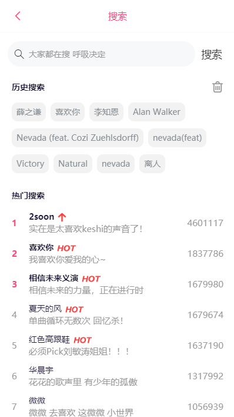
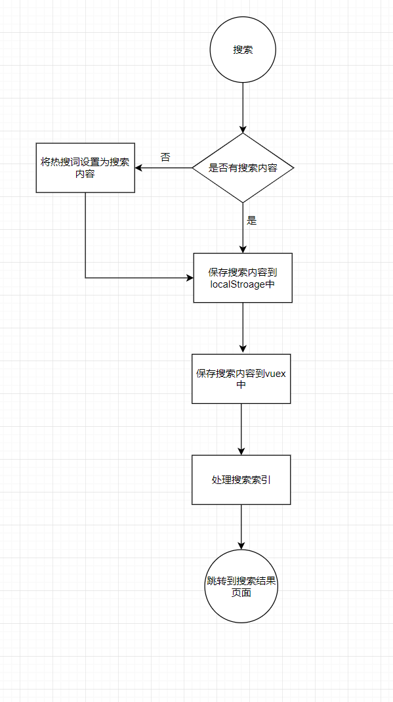

# 搜索首页



[跳转到该页](http://www.happy6year.com/#/search/searchPage)

> 搜索首页由搜索框、历史搜索、热门搜索组成

## 功能说明

一、搜索框

- 直接点击搜索默认以热搜词作为搜索内容
- 输入内容时会有搜索提示，便于用户搜索


二、历史搜索

- 点击获取相应搜索结果
- 点击垃圾桶移除localStroage中的搜索记录

三、热门搜索

- 点击获取相应搜索结果

## 搜索业务流程图



## 添加搜索记录业务代码

```javascript
const SET_MAX_LENGTH = 10
const LOCAL_LIST_NAME = 'localSearchList'
export function addLocalSearch(value) {
  if (value.trim().length === 0) {
    return
  }
  // 添加到本地历史搜索列表
  let arr = getItem(LOCAL_LIST_NAME)
  if (!arr) { // 如果本地中还没有该搜索列表就初始化一个数组
    arr = []
  }
  // 查询该搜索内容是否存在
  let index = arr.findIndex(item => item === value)
  if (index === -1) { // 不存在就添加
    arr.unshift(value)
  }
  if (arr.length > SET_MAX_LENGTH) { // 当搜索内容超过最大值时弹出最后一个
    arr.pop()
  }
  setItem(LOCAL_LIST_NAME, arr) // 最后将该历史搜索列表添加到本地存储中
}
// 移除本地存储搜索列表
export function clearLocalList() {
  window.localStorage.removeItem(LOCAL_LIST_NAME)
}
// 获取本地存储搜索列表
export function getLocalList() {
  return JSON.parse(window.localStorage.getItem(LOCAL_LIST_NAME))
}
```

## 遇到的问题

1.当前页面为搜索结果，当再次进行搜索时，存在相同路由跳转错误

- 解决方式：使用reload()   (provide / inject 组合 )

- 实现思路：

  - 修改APP.vue

    ```javascript
    <template>
      <div id="app">
            <router-view v-if="isRouterAlive"></router-view>
      </div>
    </template>

    <script>
    export default {
      provide () {
        return {
          reload: this.reload
        }
      },
      data () {
        return {
          isRouterAlive: true
        }
      },
      methods: {
        reload () {
          this.isRouterAlive = false
          this.$nextTick(() => {
            this.isRouterAlive = true
          })
        }
    }
    </script>
    ```

  - 在执行搜索跳转时调用reload()

    ```javascript
    <script>
    export default {
      name: 'search',
      data () {
        ...
      },
      inject: ['reload'],
      methods: {
        search (searchIndex = 0) {
          this.closeSearchList()
          // 设置搜索标签页
          this.setSearchCurrentIndex(searchIndex)
          // 将搜索的内容保存在本地
          addLocalSearch(this.searchKeywords)
          if (this.$route.path === '/search/searchPage') {
            this.$router.replace('/search/searchResult')
          } else {
            // 添加搜索组件到不需要缓存组件中
            // 添加不缓存路由
            this.setAddNoCacheComponents('search')
            // 设置为前进页面
            this.setIsAdvance(true)
            //刷新页面
            this.reload()
          }
        }
      }
    }
    </script>
    ```

    > 即使页面刷新，需要搜索的数据依然保留在vuex中，页面一旦刷新，会再次执行搜索

## 性能优化

- 使用防抖函数对搜索框搜索输入进行优化,只需用户最后一次输入完，再发送请求

  ```javascript
   //utils.js
  debounce(fn, delay = 500) {
      // timer是闭包中的
      let timer = null
      return function () {
        if (timer) {
          clearTimeout(timer)
        }
        timer = setTimeout(() => {
          fn.apply(this, arguments)
          timer = null
        }, delay)
      }
    }
  ```

  ```javascript
    // 输入搜索内容
      handleInput: utils.debounce(function () {
        if (this.searchKeywords.trim().length === 0) {
          this.closeSearchList()
        } else {
          this.getSearchAll().then(() => {
            // 打开搜索列表
            this.openSearchList()
          })
        }
      }, 300)
  ```

  ​


​