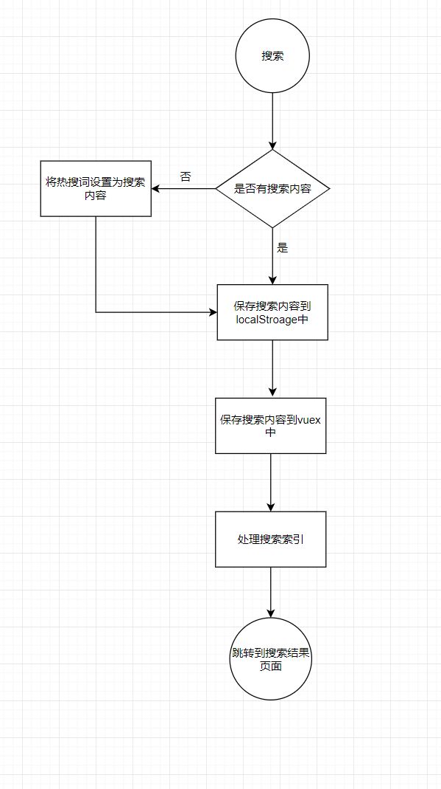

# 搜索结果

 


[跳转到该页](http://www.happy6year.com/#/)

搜索首页由搜索框、历史搜索、热门搜索组成

## 功能说明

一、搜索框

- 直接点击搜索默认以热搜词作为搜索内容


- 输入内容获取搜索结果
- 输入内容时会有搜索提示，便于用户搜索

二、历史搜索

- 点击搜索相应结果
- 点击垃圾桶移除localStroage中的搜索记录

三、热门搜索

- 点击搜索相应结果

# 搜索业务流程图





# 性能优化

- 使用防抖函数对搜索框搜索输入进行优化,只需用户最后一次输入完，再发送请求

  ```javascript
   //utils.js
  debounce(fn, delay = 500) {
      // timer是闭包中的
      let timer = null
      return function () {
        if (timer) {
          clearTimeout(timer)
        }
        timer = setTimeout(() => {
          fn.apply(this, arguments)
          timer = null
        }, delay)
      }
    }
  ```

  ​

  ```javascript
    // 输入搜索内容
      handleInput: utils.debounce(function () {
        if (this.searchKeywords.trim().length === 0) {
          this.closeSearchList()
        } else {
          this.getSearchAll().then(() => {
            // 打开搜索列表
            this.openSearchList()
          })
        }
      }, 300),
  ```

  ​


​